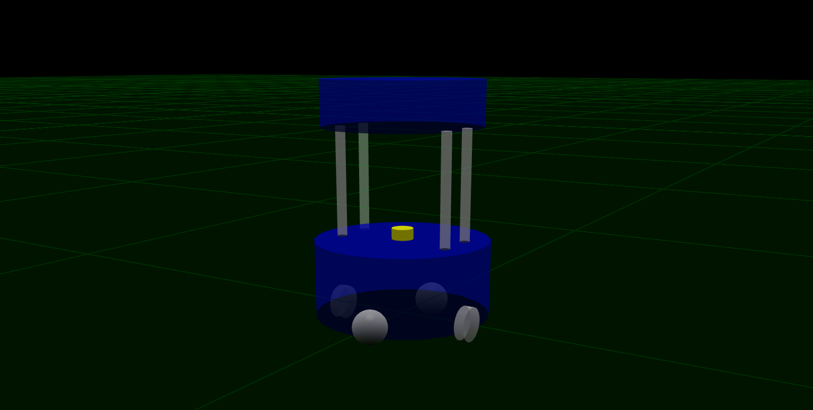
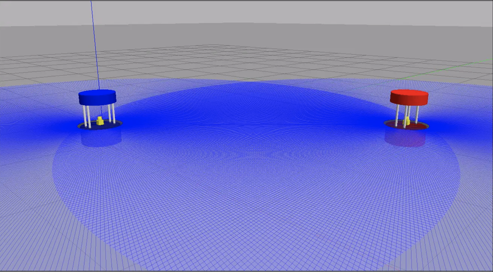
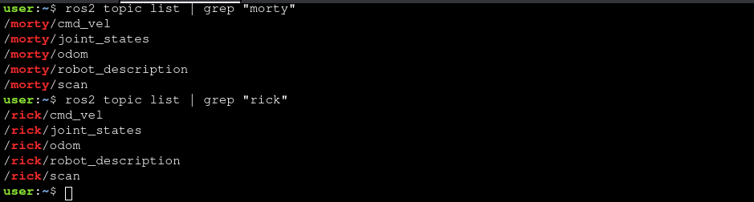
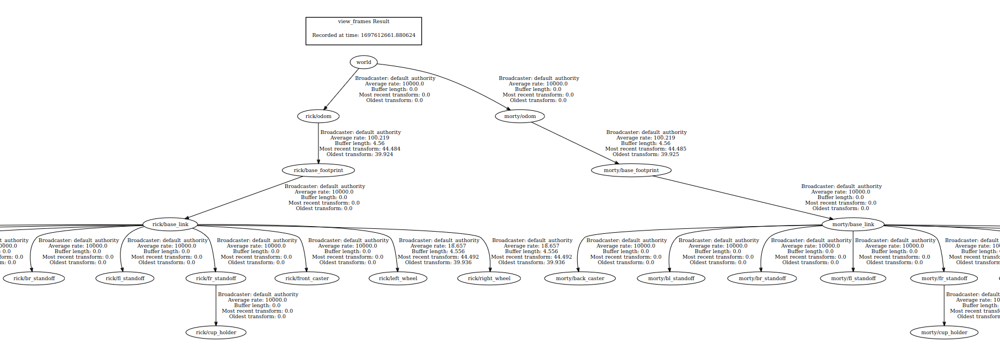

# Robot Chase

The objective is to create a robot model using URDF and subsequently refactor it using `XACRO` macros, then to implement an algorithm that enables a robot to pursue and follow another robot that is attempting to evade capture (play the game of tag).

  

## Structure

```text
.
├── CMakeLists.txt
├── package.xml
├── README.md
└── src
    └── robot_chase.cpp
```

## Setup

#### Distribution

Use docker for quick-start (for both ROS1 or ROS2):

```sh
# using docker for ROS1
$ docker run -ti --rm --name local-ros-noetic ros:noetic
```

```sh
# using docker for ROS2
$ docker run -ti --rm --name local-ros-humble ros:humble
```

#### Build (Package)

Now, create a catkin workspace, clone the package:

```sh
# setup directory
$ mkdir ~/ros2_ws/src/
$ git clone <repo_name> ~/ros2_ws/src/
```

Install the required packages (dependency) mentioned in `package.xml` using `apt`:

```sh
# check if package is available
$ ros2 pkg list
$ ros2 node list
```

```sh
# update path to installed packages
$ source /opt/ros/humble/setup.bash
```

To build locally or inside docker use the following commands:

```sh
# execute build
$ cd ~/ros2_ws && colcon build
$ source ~/ros2_ws/install/setup.bash
```

## Barista Robot (URDF)

The `barista_robot` is simple four wheel cylinder robot with total weight of `18 kg` and accurate physics (i.e. [inertial](https://en.wikipedia.org/wiki/List_of_moments_of_inertia) properties and friction):

#### Links

- `base_footprint` (located at the center bottom of the base cylinder)
- `base_link` (located at the center of the rotation axis that connect the two wheels)
- `right_wheel` and `left_wheel`
- `front_caster` and `back_caster`
- `base_laser` (connect with `base_link`)
- `fr/fl/br/bl_standoff` (four standoff rods connected to `base_link`)
- `cup_holder` (for robot top connect with one of the standoff rods)

#### Xacrofy

The same urdf has been split into multiple `XACRO` file.

- `barista_robot_model.urdf.xacro`
- `base.xacro`
- `wheel.xacro`
- `standoff.xacro`
- `cup_holder_tray.xacro`
- `laser.xacro`



For more about robot description check [this](https://github.com/llabhishekll/barista_robot_description).

## Launch

The `barista_two_robots.launch.py` launch file contains the followings nodes:

- `robot_state_publisher` (publish the state of a robot to [tf2](http://ros.org/wiki/tf2))
- `rviz2` (for visualization and control)
- `spawn_entity` (to spawn robot in gazebo environment)

```sh
# execute to spawn two robot
$ ros2 launch barista_robot_description barista_two_robots.launch.py
```

**Note:** `Rick` is blue and `Morty` is red.



```sh
# execute to check namespace
$ ros2 topic list | grep "morty"
$ ros2 topic list | grep "rick"
```



```sh
# execute to tf frames and connections
$ ros2 run tf2_tools view_frames
```



## Node

The node listens to one of the `TF frames` of Morty and uses a simple controller that uses the transformation to send velocity commands to Rick, so that Rick can follow Morty.

```sh
# start robot chase node
$ ros2 run robot_chase robot_chase
```

```sh
# to start morty movement
$ ros2 topic pub /morty/cmd_vel geometry_msgs/Twist "linear:
  x: 0.2
  y: 0.0
  z: 0.0
angular:
  x: 0.0
  y: 0.0
  z: 0.05"
```

The expected behavior is that when you run the node, Rick will start moving and turning towards Morty. If Morty does not move, Rick will eventually collide with him. If Morty moves, Rick will keep chasing him and try to “catch” him.


## Specifications

#### TF

Node gets the latest transform between **rick/base_link** and **morty/base_link** and calculate the distance (`error_distance`) and angular error (`error_yaw`) between the ricks and morty reference frames to get the desired linear and angular velocity.

```sh
# check the transformation between two links
$ ros2 run tf2_ros tf2_echo rick/base_link morty/base_link
```

#### Static Transformer

The node `static_transform_publisher` is defined for both the robot, to provide world frame as parent.

```sh
ros2 run tf2_ros static_transform_publisher --x 0 --y 0 --z 0 --frame-id frame_id -child-frame-id child_frame_id
```

## Roadmap

- [x] Part 1 : Define robot namespace to avoid conflict.

- [x] Part 2 : Create robot following node using `TFs`.

See the [open issues](https://github.com/llabhishekll/) for a full list of proposed features (and known issues).

## Tools

System tool/modules used for project development.

- `Applications` : [vs-code](https://code.visualstudio.com/), [ros-extensions](https://marketplace.visualstudio.com/items?itemName=ms-iot.vscode-ros) and [docker-desktop](https://docs.docker.com/get-docker/).
- `ROS` : [ros-docker-images](https://hub.docker.com/_/ros/) (`humble`, `noetic`) or [build-source](https://www.ros.org/blog/getting-started/).

## License

Distributed under the MIT License. See `LICENSE.txt` for more information.
